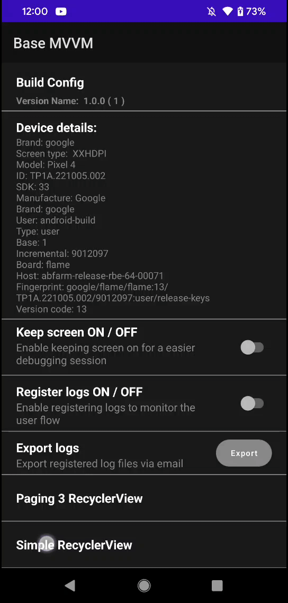
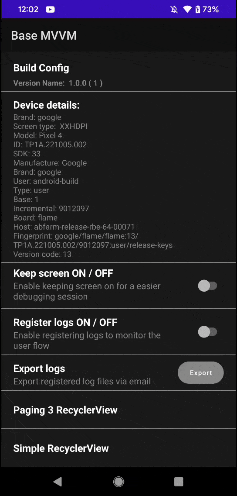

# Custom RecyclerView and Adapters

Since almost every app has a list, most of them are paginated I decided to create a custom recyclerview for easier implementation (I hope).
This example will include SwipeToRefreshLayout, Simple Adapter, Paginated Adapter with loading/error footer. Base class is [`BaseRecyclerView`](../../components/BaseRecyclerView.kt)

### Let's start with Simple Adapter:

- **Adapter** that extend [`BaseAdater`](BaseAdapter.kt) with Model, Binding and Comparator, then you will need to override onBind

        class DemoAdapter(  
            private val itemClick: (DemoModel) -> Unit? = {}  
        ): BaseAdapter<DemoModel, ViewHolderDemoBinding>(ViewHolderDemoBinding::inflate, Comparator) {  
      
            override fun ViewHolderDemoBinding.onBind(context: Context, item: DemoModel, position: Int) {  
                textView.text = item.title  
                rootView.setOnClickListener {  
                    itemClick.invoke(item)  
                }  
            }  
        
            object Comparator : DiffUtil.ItemCallback<DemoModel>() {  
                override fun areItemsTheSame(oldItem: DemoModel, newItem: DemoModel) =  
                    oldItem.id == newItem.id  
        
                override fun areContentsTheSame(oldItem: DemoModel, newItem: DemoModel) =  
                    oldItem.title == newItem.title  
                }  
        }

- In **Activity/Fragment** you can have something like:

        val demoAdapter = DemoAdapter(itemClick = { item ->
            
        })  
        
        observe(viewModel.listLiveData) {  
            demoAdapter.submitList(it)  
            binding.simpleRecyclerView.isRefreshing = false  
        }  
        
        binding.simpleRecyclerView.setLayoutManager(LinearLayoutManager(this))  
        binding.simpleRecyclerView.setAdapter(demoAdapter, swipeRefreshListener = {  
            viewModel.getList(isFromRefresh = true)  
        })

### Complex Adapter
This is an infinite list with loading/error state

- **Adapter** that extends [`PagingBaseAdapter`](PagingBaseAdapter.kt):

        class DemoInfiniteAdapter(  
            private val itemClick: (DemoModel, Int) -> Unit,  
            private val itemLongClick: (DemoModel, Int) -> Unit  
        ): PagingBaseAdapter<DemoModel, ViewHolderDemoBinding>(ViewHolderDemoBinding::inflate, Comparator) {  
            override fun ViewHolderDemoBinding.onBind(item: DemoModel?, context: Context, position: Int) {  
                item?.let {  
                    textView.text = it.title  
                    rootView.setOnClickListener {  
                        itemClick.invoke(item, position)  
                    }  
                    rootView.setOnLongClickListener {  
                        itemLongClick.invoke(item, position)  
                        true  
                    }  
                }  
            }  
        
            object Comparator : DiffUtil.ItemCallback<DemoModel>() {  
                override fun areItemsTheSame(oldItem: DemoModel, newItem: DemoModel) = oldItem.id == newItem.id  
        
                override fun areContentsTheSame(oldItem: DemoModel, newItem: DemoModel) =  
                    oldItem.title == newItem.title  
            }  
        }

- You will need to add layout [`R.layout.view_holder_item_network_state`](../../../../../../../res/layout/view_holder_item_network_state.xml) and customize based on your design but keep ids of the views, or you can change it and adjust [`PagingLoadStateAdapter`](PagingLoadStateAdapter.kt) class.

- In **Activity/Fragment**:

        val adapter = DemoInfiniteAdapter (
            itemClick = { item, position ->
                viewModel.edit(item, position)
            },
            itemLongClick = { item, position ->
                viewModel.delete(item)
            }
        )
        
        binding.recyclerView.setLayoutManager(LinearLayoutManager(this))
        binding.recyclerView.setAdapter(adapter)

        observe(viewModel.listLiveData) {
            adapter.submitData(lifecycle, it)
        }

        viewModel.getDemoList()

- In **ViewModel**:
    - you will need a MutableStateFlow for modifications like update/delete and [`PagerUtils`](PagerUtils.kt):
            
            private val modificationEvents = MutableStateFlow<List<PagingEvent<DemoModel>>>(emptyList())

    - get list will use `createPager`, `combineForEvent` where you will have list with events and delete/edit blocks to find the element (based on id most of the time)
            
            fun getDemoList() {
                viewModelScope.launch {
                    createPager { page, size ->
                        mockInfiniteApi(page, size)
                    }
                        .flow
                        .combineForEvent(viewModelScope, modificationEvents,
                            deleteBlock = { first, second ->
                                return@combineForEvent first.id != second.id
                            },
                            editBlock = { first, second ->
                                return@combineForEvent if (first.id == second.id) {
                                    first
                                } else {
                                    second
                                }
                            }
                        )
                        .collect {
                            listLiveData.setValue(it)
                        }
                }
            } 

    - delete/edit functions: 
            
            fun delete(item: DemoModel) {
                setIsLoading(true)
                viewModelScope.launch {
                    delay(1000) // delete api
                    setIsLoading(false)
                    modificationEvents.value += PagingEvent.Delete(item)
                }
            }

            fun edit(item: DemoModel, position: Int) {
                setIsLoading(true)
                viewModelScope.launch {
                    delay(2000) // delete api
                    setIsLoading(false)
                    
                    val newItem = item.copy(title = "${item.title} updated")
                    modificationEvents.value += PagingEvent.Edit(newItem)
                }
            }

    - mockInfiniteApi function looks like this (different from what we usually use, without `Resource` state)

            @Throws(HttpException::class)
            private suspend fun mockInfiniteApi(page: Int, size: Int): MutableList<DemoModel> {
                delay(2000)
                val list = mutableListOf<DemoModel>()
                if (page < 8) {
                    if(page == 5) {
                        throw (HttpException(Response.error<ResponseBody>(400, "Something went wrong".toResponseBody("plain/text".toMediaType()))).fillInStackTrace())
                    }
                    for (position in 0..size) {
                        list.add(DemoModel("${page}_${position}", "Page $page element: $position"))
                    }
                }
                return list
            }
